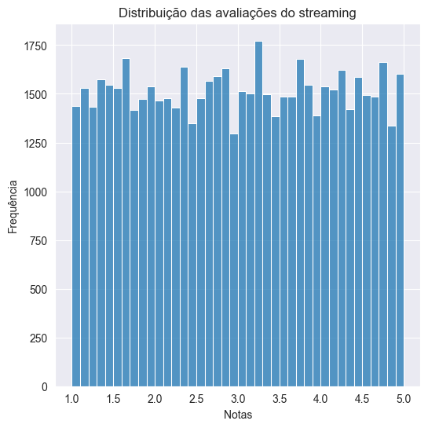
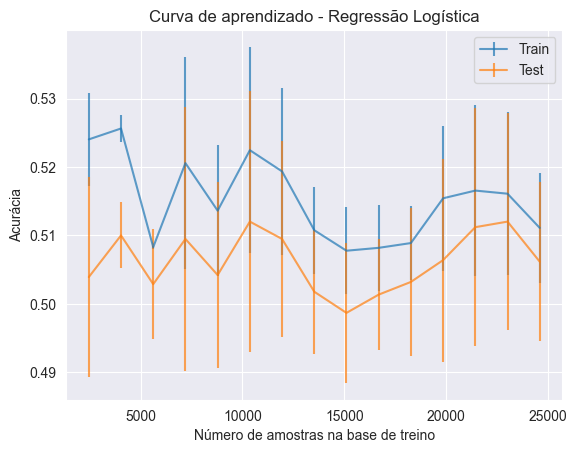

# Case - Prevendo casos de churn em uma plataforma de streaming

## Introdução

Em uma plataforma de streaming, a diretoria está preocupada com o alto índice de usuários cancelando as suas assinaturas. Eles acreditam que é possível prever se um usuário tem mais chance de deixar a plataforma antes que isso aconteça, e com base nessa informação tomar ações para reduzir o churn. Para realizar tal trabalho, a empresa forneceu uma base de dados em csv contendo dados sobre as contas dos clientes.

## Objetivo do projeto

O objetivo é criar um modelo de classificação utilizando machine learning que seja capaz de prever se um usuário tem mais chance de cancelar a sua assinatura na plataforma ou não.

## Sobre os dados

Os dados fornecidos possuem informações sobre as contas dos clientes na plataforma de streaming, divididos entre contas Basic, Standard e Premium, onde cada uma oferece uma gama maior de serviços que a anterior.

- user_id = Código de identificação do cliente;
- age = Idade do cliente;
- gender = Gênero do cliente;
- time_on_plataform = Dias de assinatura ativa do cliente;
- subscription_type = Tipo de conta;
- avg_rating = Avaliação média dos conteúdos da plataforma;
- num_active_profiles = Número de perfis ativos na plataforma;
- num_streaming_services = Quantidade de serviços de streaming que o cliente possui;
- devices_connected = Quantidade de dispositivos conectados à conta;
- churned = Se o cliente cancelou a conta ou não.

## Bibliotecas utilizadas

Segue uma lista com as bibliotecas em Python utilizadas no desenvolvimento e resolução do case.

- pandas
- numpy
- matplotlib
- seaborn
- plotly
- sklearn

## Deployment

Para executar o projeto é necessário baixar o arquivo "case_classificacao_churn_streaming.ipynb" (código do projeto) e o database "streaming_data.csv". Feito isso, salvar ambos os arquivos na mesma pasta e executar o código utilizando programas de visualização e leituras de códigos em jupyter notebook, como Visual Studio Code por exemplo, ou algum outro software similar.

Obs: para executar o código corretamente as bibliotecas listadas na sessão anterior precisam estar instaladas em sua máquina.

## Análise dos dados

### Idade

- Histograma das idades dos clientes

É possível observar um comportamento quase que simétrico dos dados, com uma distribuição homogênea ao longo de todas as idades, sem muito destaque para nenhuma faixa etária. Estamos falando da fase adulta, abrangendo desde pessoas no período universitário, de graduação e início da carreira (20-30 anos) até pessoas que já estão no auge de sua carreia/momento financeiro mais estável (40-60 anos). Isto também demonstra que não existe um público alvo muito marcante na empresa.

### Tempo de contrato ativo

- Histograma do tempo de contrato por cliente

Observa-se a uma massa bem distribuída de clientes que estão em contrato entre 2000 até mais de 8000 dias.

Contudo, importante destacar que esta é coluna apresenta muitos dados nulos.Logo, esta análise deve ser feita com cautela, considerando que estes dados ao serem tratados, podem passar uma visão diferente desta realidade.

### Aparelhos conectados

- Histograma dos aparelhos conectados ao serviço de streaming por cliente

O resultado do gráfico acima mostra um equilíbrio muito grande no número de aparelhos conectados por cliente, mostrando uma pluralidade de perfis e faixas sociais muito grande entre os clientes da empresa. Isto corrobora fortemente com a análise feita com as faixas etárias anteriormente, onde ficou claro a existência de clientes com 20 até mais de 60 anos.

### Quantidade de serviços de streaming contratados

- Histograma da quantidade de serviços de streaming contratados por cliente

Observa-se uma distribuição muito parelha também na quantidade de serviços de streaming por cliente, com dados praticamente iguais. Também casa com a pluradidade de possíveis configurações familiares para a vasta faixa etária de clientes desta empresa.

Pelo gráfico acima, conforme previsto existem alguns outliers nesta coluna. Como não são muitos, não são provenientes de erros e também não são dados completamente da fora da realidade possível desta coluna (número de serviços de streaming assinados pelo cliente), optou-se por não excluí-los nem fazer qualquer tipo de tratamento ou transformação com eles.

### Número de perfis ativos na plataforma de streaming

- Histograma da distribuição do número de perfis ativos na plataforma de streaming

Aqui existe um equilíbrio muito grande, com dados praticamente iguais na quantidade de perfis. O que também reforça a tese da distribuição das idades, onde ficou claro que não existe um nicho específico de cliente, abordando diversos tipos de cliente e configurações familiares. Existem tanto clientes que moram com outras pessoas, quanto muitos que são solteiros ou moram sozinhos, e por consequência tem apenas 1 perfil em suas contas.

### Avalição média

- Histograma da distribuição de avaliações dos clientes ao serviço de streaming

Da mesma forma que as demais colunas, aqui também observa-se um equilíbrio muito grande nas avaliações dadas pelos clientes, com uma média das notas igual a 3. Do ponto de vista do negócio, este não é um resultado a ser bem visto pela empresa pois demonstra que as opiniões estão muito dividas com relação aos conteúdos da plataforma, onde o ideal seria uma maior concentração de notas nas faixas mais altas, de 4 a 5.

### Churned

- Gráfico de pizza da distribuição dos casos de churn e não churn no dataset

Pelo resultado acima percebe-se que existe uma frequência maior de clientes que não viraram churn (0.0) do que clientes que são churn (1.0). Contudo, é justificável a preocupação do gestor da empresa, pois o percentual de churn está de fato bem aumento, com 26.1% dos dados não nulos.

## Modelling

Com os dados devidamente tratados, agora é possível partir para o processo de definição do modelo de machine learning. Recapitulando o objetivo deste projeto, o modelo precisa prever se um usuário tem chance de cancelar a sua assinatura na plataforma. Desta forma, o foco aqui é calcular se o cliente irá se tornar churn ou não.

### Modelo de Regressão Logística

- Matriz de confusão deste modelo

Pelo resultado acima, a quantidade de verdadeiros negativos previstos pelo modelo, ou seja, casos em que o modelo preveniu que o cliente não era churn e de fato ele não era, foi de 7481. Contudo, o modelo não previu nenhum churn na base de teste, ou seja, os 1741 casos de churn presentes nesta base foram previstos como não churn.

Desta forma, a quantidade de verdadeiros positivos previstos pelo modelo (casos em que o modelo preveniu que o cliente era churn e de fato ele era) foi 0. Ou seja, o modelo errou todas as previsões em que os clientes eram churn.

Isto interfere diretamente nas métricas Precision, que mede a acurácia das previsões positivas, Recall (porcentagem de verdadeiros positivos dentro da classe dos positivos reais) e consequentemente no F1 Score que estabelece uma relação entre o Precision e Recall.

Abaixo calculou-se cada uma das métricas utilizando a função definida anteriormente, exibindo os resultados na tabela.

<table border="1" class="dataframe">
  <thead>
    <tr style="text-align: right;">
      <th></th>
      <th>Acurácia</th>
      <th>Acurácia Balanceada</th>
      <th>Precisão</th>
      <th>Recall</th>
      <th>F1</th>
      <th>ROCAUC</th>
    </tr>
  </thead>
  <tbody>
    <tr>
      <th>Treino</th>
      <td>0.803690</td>
      <td>0.5</td>
      <td>0.0</td>
      <td>0.0</td>
      <td>0.0</td>
      <td>0.514833</td>
    </tr>
    <tr>
      <th>Teste</th>
      <td>0.811212</td>
      <td>0.5</td>
      <td>0.0</td>
      <td>0.0</td>
      <td>0.0</td>
      <td>0.491372</td>
    </tr>
  </tbody>
</table>

Percebe-se que acurácia ainda manteve um valor ok, com média  em torno de 80% considerando as bases de treino e teste. Isto acontece pois a acurácia depende tanto dos verdadeiros positivos quanto os verdadeiros negativos. Porém as métricas que dependem excluivamente dos casos positivos deram 0.0 conforme o esperado, como Precisão, Recall e F1.

Este comportamento do modelo pode em certa parte ser explicado pelo fato das classes da coluna target 'Churned' serem muito desbalanceadas, ou seja, existem muito mais casos de clientes que não são churn do que casos de clientes que são churn. Isto fica claro ao se avaliar as probabilidades de resposta dos clientes da base de teste, conforme demonstrado abaixo.

<table border="1" class="dataframe">
  <thead>
    <tr style="text-align: right;">
      <th></th>
      <th>Probabilidade de não churn</th>
      <th>Probabilidade de Churn</th>
    </tr>
  </thead>
  <tbody>
    <tr>
      <th>0</th>
      <td>0.799363</td>
      <td>0.200637</td>
    </tr>
    <tr>
      <th>1</th>
      <td>0.815274</td>
      <td>0.184726</td>
    </tr>
    <tr>
      <th>2</th>
      <td>0.802754</td>
      <td>0.197246</td>
    </tr>
    <tr>
      <th>3</th>
      <td>0.808176</td>
      <td>0.191824</td>
    </tr>
    <tr>
      <th>4</th>
      <td>0.810443</td>
      <td>0.189557</td>
    </tr>
    <tr>
      <th>...</th>
      <td>...</td>
      <td>...</td>
    </tr>
    <tr>
      <th>9217</th>
      <td>0.797758</td>
      <td>0.202242</td>
    </tr>
    <tr>
      <th>9218</th>
      <td>0.804854</td>
      <td>0.195146</td>
    </tr>
    <tr>
      <th>9219</th>
      <td>0.809902</td>
      <td>0.190098</td>
    </tr>
    <tr>
      <th>9220</th>
      <td>0.796438</td>
      <td>0.203562</td>
    </tr>
    <tr>
      <th>9221</th>
      <td>0.807268</td>
      <td>0.192732</td>
    </tr>
  </tbody>
</table>

9222 rows × 2 columns

Observa-se que existe uma tendência muito alta do valor previsto sempre ser 0, ou seja, não churn. A coluna de probabilidade do resultado previsto ser não churn apresentou uma média de 80% nesta base de teste. Logo, fica claro o desbalanceamento das classes a serem previstas.

Para tentar corrigir isto, utilizou-se do parâmetro "class_weight" dentro do estimador, conforme demonstra a sessão a seguir.calculou-se a média da probabilidade desta tendência.

### Modelo de Regressão Logística "balanceado"

- Matriz de confusão para este modelo

Observa-se agora uma distribuição de resultados previstos pelo modelo muito mais dividida e balanceada, prevendo ao todo 4518 casos de churn e 4704 casos de não churn. Isto faz com que as métricas de Precision, Recall e F1 saiam do zero, contudo observa-se uma disparada dos casos de falsos positivos, com 3698 exemplares, interferindo diretamente na acurácia, o que certamente irá fazer com que esta métrica piore.

Abaixo exibiu-se os resultados de cada uma das métricas.

<table border="1" class="dataframe">
  <thead>
    <tr style="text-align: right;">
      <th></th>
      <th>Acurácia</th>
      <th>Acurácia Balanceada</th>
      <th>Precisão</th>
      <th>Recall</th>
      <th>F1</th>
      <th>ROCAUC</th>
    </tr>
  </thead>
  <tbody>
    <tr>
      <th>Treino</th>
      <td>0.507180</td>
      <td>0.507061</td>
      <td>0.200807</td>
      <td>0.506866</td>
      <td>0.287653</td>
      <td>0.514827</td>
    </tr>
    <tr>
      <th>Teste</th>
      <td>0.499133</td>
      <td>0.488337</td>
      <td>0.181496</td>
      <td>0.470994</td>
      <td>0.262023</td>
      <td>0.491352</td>
    </tr>
  </tbody>
</table>

Conforme previsto, a acurácia tanto de teste quanto de treino reduziu bastante, contudo a Precisão, Recall e F1 apresentam valores mais condizentes, devido justamente ao modelo agora conseguir prever alguns casos positivos de churn.

Porém, avaliando as métricas como um todo, este modelo apresentou claramente um caso de underfitting. Isto fica claro se compararmos com o resultado sem o balanceamento de casos, onde a acurácia de teste foi 81%. Ou seja, o modelo que preveniu todos os resultados iguais (todos os clientes como churn) foi mais acertivo que este outro, que teve uma acurácia de teste de apenas 49%.

O que nos leva a concluir que este modelo de Regressão Logística não poderia ser aplicado em produção para prever os casos de novos clientes.

### Modelo Random Forest

- Matriz de confusão deste modelo

Para este caso, a quantidade de verdadeiros negativos previstos pelo modelo foram 7381. Já a quantidade de verdadeiro positivos foi 16. Contudo, a quantidade de falsos negativos ainda foi muita alta com 1725 casos, apresentando também 100 de falsos positivos. Desta forma, este modelo teve um total de erros = 1725 + 100 = 1825.

Abaixo está a tabela com as métricas de performance deste modelo.

<table border="1" class="dataframe">
  <thead>
    <tr style="text-align: right;">
      <th></th>
      <th>Acurácia</th>
      <th>Acurácia Balanceada</th>
      <th>Precisão</th>
      <th>Recall</th>
      <th>F1</th>
      <th>ROCAUC</th>
    </tr>
  </thead>
  <tbody>
    <tr>
      <th>Treino</th>
      <td>0.998420</td>
      <td>0.998749</td>
      <td>0.992709</td>
      <td>0.99929</td>
      <td>0.995989</td>
      <td>0.999929</td>
    </tr>
    <tr>
      <th>Teste</th>
      <td>0.802104</td>
      <td>0.497911</td>
      <td>0.137931</td>
      <td>0.00919</td>
      <td>0.017232</td>
      <td>0.504154</td>
    </tr>
  </tbody>
</table>

Como é possível avaliar, este é um típico caso de Overfitting, onde as métricas da base de treino são bem próximas a 1 e bem maiores que as métricas da base de teste. Isto acontece quando o modelo de machine learning "decora" a base de treino, acertando praticamente tudo, mas quando é passada uma nova base diferente, o modelo se perde em suas previsões, apresentando resultados bem inferiores. Portanto, será necessária uma otimização de hiperparâmetros neste modelo, para tentar corrigir este problema.

### Otimizando os hiperparâmetros do modelo Random Forest Classifier com GridSearchCV

Para otimizar os hiperparâmetros do modelo Random Forest Classifier testado anteriormente, foi utilizada a função GridSearchCV( ) da biblioteca sklearn, onde é passado um dicionário com os parâmetros que deseja-se otimizar, qual métrica será usada como base para escolher o melhor cenário e qual tipo de cross-validation será feito.

Neste projeto, utilizou-se como métrica a acurácia, com um cross-validation = 5, sendo os parâmetros "max_depth" e "n_estimators" a serem otimizados.

- Matriz de confusão do modelo otimizado

Otimizados os hiperparâmetros, a quantidade de verdadeiros negativos previstos pelo modelo diminuiu, apresentando 6364 casos. Já a quantidade de verdadeiros positivos aumentou bem, agora com 240 casos. Contudo, a quantidade de falsos positivos disparou, com 1117 casos, mantendo alta ainda a quantidade de falsos negativos com 1501 casos.

Interessante observar com estes dados que o modelo com os hiperparâmetos otimizados apresentou um comportamento bem mais "uniforme", ou seja, conseguiu prever com maior eficiência os casos de churn presentes na base de teste. Porém, diminui a eficiência para prever casos de não churn.

Seguem abaixo todas as métricas deste modelo.

<table border="1" class="dataframe">
  <thead>
    <tr style="text-align: right;">
      <th></th>
      <th>Acurácia</th>
      <th>Acurácia Balanceada</th>
      <th>Precisão</th>
      <th>Recall</th>
      <th>F1</th>
      <th>ROCAUC</th>
    </tr>
  </thead>
  <tbody>
    <tr>
      <th>Treino</th>
      <td>0.873170</td>
      <td>0.816251</td>
      <td>0.662183</td>
      <td>0.722538</td>
      <td>0.691045</td>
      <td>0.924343</td>
    </tr>
    <tr>
      <th>Teste</th>
      <td>0.716114</td>
      <td>0.494270</td>
      <td>0.176861</td>
      <td>0.137852</td>
      <td>0.154939</td>
      <td>0.488635</td>
    </tr>
  </tbody>
</table>

Observa-se que de certa forma o problema de overfitting apresentado pelo Random Forest inicialmente foi solucionado, mas para tal foi necessário "forçar" que o modelo prevê-se mais casos de churn. Isto ocasionou uma melhora nas métricas de Precisão, Recall e F1, da mesma forma que foi observado no modelo de Regressão Logística com as classes balanceadas da variável target.

Fazendo uma análise das métricas no geral, perceb-se que ainda estão abaixo do ideal, o que nos leva a concluir que essa otimização dos hiperparâmetros corrigiu o problema do overfitting mas gerou um underfitting.

Outro ponto importante é que, com uma acurácia de 71% na base de teste, este modelo também performou abaixo do modelo que preveniu todos os resultados como não churn. Ou seja, se chutarmos todos os casos de uma base nova como não churn, teríamos mais chance de acertar mais previsões do que aplicando este modelo de machine learning.

Desta forma, estes resultados mostram que este modelo também não seria ideal para ser aplicado em produção para prever os casos de novos clientes.

### Curva de aprendizado dos modelos

- Curva de aprendizado do modelo de Regressão Logística "balanceado":

Observa-se que as métricas de treino e teste apresentam variações de comportamento conforme a mudança da quantidade de amostras na base de treino, contudo sempre permancendo na faixa de 49% a 53%.

A maior acurácia de teste se encontra com um número de amostras perto dos 23000, mais ou menos, porém se trata de um valor em torno de 51%, bem próximo aos 49% encontrados utilizando a base de treino com 21517 amostras.

Logo, a mudança no tamanho da base de treino mudaria a performance mas para valores muito próximos uns dos outros, sempre permanecendo abaixo dos 80% mínimo aceitáveis, levando em conta a acurácia de prever sempre que os clientes serão churn.

- Curva de aprendizado do modelo Random Forest Classifier:

Observa-se, diferentemente do modelo de Regressão Logística, as métricas de treino e teste apresentam variações muito pequenas de comportamento conforme a mudança da quantidade de amostras na base de treino.

Fica claro pelo gráfico que, independentemente do tamanho da base de treino, o modelo de Random Forest sem otimização de parâmetros irá ter um comportamento de overffiting. Isto leva a concluir-se que seria um modelo com uma queda de performance se colocado em produção com uma gama muito grande de novos clientes.